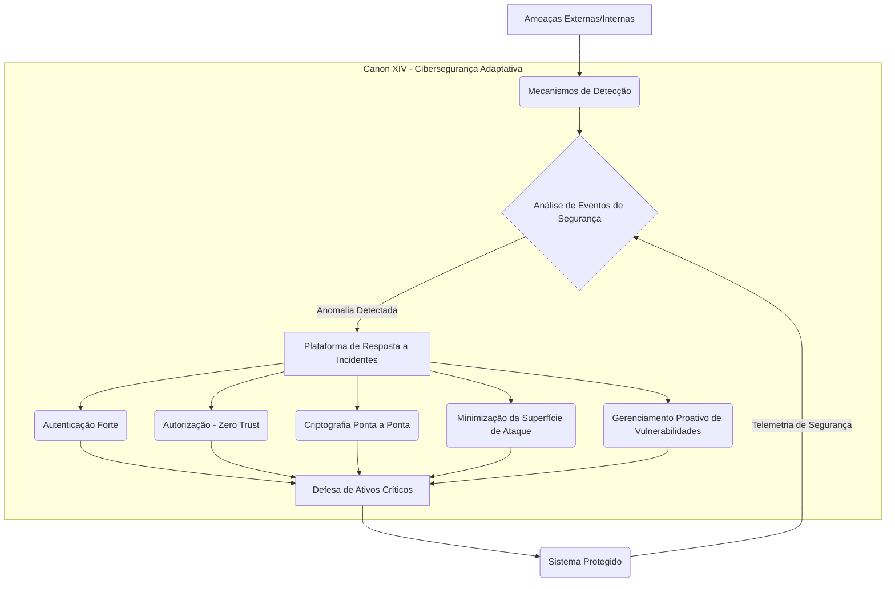

# ⚖️ The Canonical Protocol of Engineering & AI: Software Governance and AI Guardrails
[](https://doi.org/10.5281/zenodo.19804968)
[](https://opensource.org/licenses/Apache-2.0)
[](https://nodejs.org/)
[](https://owasp.org/)
[](https://github.com/njfw50/codigo-canonico-engenharia-ai/actions)

## A Structured Technocracy for Software Governance, Combating 'Vibe Coding' and Cognitive Debt in AI-Driven Projects

### 🛡️ The Conceptual Defense (Manifesto)
The modern software development landscape is frequently compromised by stylistic wars, resume-driven development, and the chaotic entanglement of architectural layers. With the advent of autonomous AI agents, the speed of code generation has outpaced the rigor of structural governance, leading to a catastrophic accumulation of technical debt and unmaintainable architectures.

**The Canonical Protocol is our definitive response.**

This repository does not contain mere "best practices" or "suggestions." It establishes a **Structured Technocracy** for **software governance** and **AI engineering**. It operates under the fundamental axiom that **architectural integrity** supersedes personal preference, industry fads, and AI stochasticity. It is the definitive answer to **'Vibe Coding'** and the growing **Cognitive Debt** in development projects involving artificial intelligence.

We reject the notion of technical democracy where every Pull Request is a negotiation of fundamental standards. Instead, we submit to the **Doctrine of the Single Source of Truth (SSOT)**. Every piece of code, whether authored by a human Engineer or an AI collaborator, must undergo a rigorous Canonical Audit. If an implementation violates layer separation or introduces arbitrary complexity, it is inherently defective, regardless of its operational status.

By classifying system components, mandating strict boundaries, and requiring explicit governance for any structural mutation, we guarantee that the system remains highly auditable, deeply secure, and optimized for Advanced Data Analysis.

**This is not just code; it is institutional memory.**

---

## 🚀 Quick Start Guide

Para começar a usar o Protocolo Canônico e injetar suas regras em seus projetos de IA, siga estes três passos simples:

1.  **Clone o repositório:**
    ```bash
    git clone https://github.com/njfw50/codigo-canonico-engenharia-ai.git
    ```
2.  **Navegue até o diretório do projeto:**
    ```bash
    cd codigo-canonico-engenharia-ai
    ```
3.  **Instale as dependências e ative a injeção canônica:**
    ```bash
    npm install
    ```
    Este comando executará automaticamente o script `inject.js`, que aplicará as regras do Protocolo Canônico aos arquivos de configuração de seus assistentes de IA (como `.cursorrules`, `.github/copilot-instructions.md`, etc.), garantindo que eles operem sob as diretrizes estabelecidas.

---

## 📊 Diagrama Arquitetural: Cibersegurança Adaptativa

A Cibersegurança Adaptativa, conforme delineada no **Canon XIV**, é um pilar fundamental do Protocolo Canônico. Ela enfatiza uma abordagem proativa e multicamadas para a defesa de sistemas, garantindo a integridade e a soberania dos dados. O diagrama a seguir ilustra os componentes e o fluxo dessa arquitetura de segurança.



**Explicação do Diagrama:**

*   **Ameaças Externas/Internas:** Representa os vetores de ataque potenciais.
*   **Mecanismos de Detecção:** Inclui IDS/IPS, SIEM, EDR, etc., que monitoram continuamente o ambiente.
*   **Análise de Eventos de Segurança:** Processa os dados dos mecanismos de detecção para identificar padrões e anomalias.
*   **Plataforma de Resposta a Incidentes:** Ativada ao detectar uma anomalia, coordena as ações de defesa.
*   **Autenticação Forte, Autorização (Zero Trust), Criptografia Ponta a Ponta, Minimização da Superfície de Ataque, Gerenciamento Proativo de Vulnerabilidades:** São os princípios centrais do Canon XIV, implementados como controles de segurança.
*   **Defesa de Ativos Críticos:** Onde os princípios de segurança são aplicados para proteger os recursos mais valiosos do sistema.
*   **Sistema Protegido:** O ambiente operacional que se beneficia dessas camadas de defesa.
*   **Telemetria de Segurança:** Feedback contínuo do sistema protegido para a análise de eventos, criando um ciclo adaptativo de melhoria da segurança.

---

## 📜 The Canonical Body (The 19 Canons): Laws for Software Governance and AI Engineering

The system is governed by 20 immutable Canons, organized into functional domains:

### Core Foundation & Authority
| Canon | Title |
|-------|-------|
| **Canon 0** | The Law of Precedence |
| **Canon I** | The Supremacy of Canonical Authority |
| **Canon II** | Normative Classification & Structural Segregation |
| **Canon III** | Change Procedure & Structural Mutation |
| **Canon IV** | Criticality Matrix & Proportionality |
| **Canon V** | The Book of Life (Immutable Audit Log) |

### Engineering & Architecture
| Canon | Title |
|-------|-------|
| **Canon VI** | Architectural Discipline & Structural Coherence |
| **Canon VII** | Pattern Library & Architectural Vocabulary |
| **Canon VIII** | Pattern Selection Criteria |
| **Canon IX** | Prohibition of Ornamental Patterns |
| **Canon X** | Layer Segregation & Boundary Enforcement |
| **Canon XII** | Pattern Implementation Directives |
| **Canon XVII** | The Doctrine of Justified Complexity |

### Cognitive Sovereignty & AI Subjugation
| Canon | Title |
|-------|-------|
| **Canon XVI** | The Module of Textual Integrity Protection |
| **Canon XVIII** | The Doctrine of Cognitive Sovereignty |
| **Canon XIX** | The Doctrine of Reference Integrity |

### Emerging Research & Provisional Canons
| Canon | Title |
|-------|-------|
| **Canon XX** | The Doctrine of Agentic Coordination and Protocol Optimization (PROVISIONAL) |
| **Canon XXI** | The Doctrine of Evaluation-Driven Development (EDD) (PROVISIONAL) |
| **Canon XXII** | The Doctrine of Code Provenance and Traceability (PROVISIONAL) |

### Evolutionary Governance
| Canon | Title |
|-------|-------|
| **Canon XI** | Amendments & Governance Procedures |
| **Canon XIII** | Normative Expansion Protocol |

### Security & Human Interaction
| Canon | Title |
|-------|-------|
| **Canon XIV** | Digital Security & Cybersecurity Axioms |
| **Canon XV** | User Experience & Interaction Safety |

---

## 🏗️ Repository Structure: A Guide to Software Governance and AI Engineering

```
codigo-canonico-engenharia-ai/
│
├── README.md                  # The Conceptual Defense & Index
├── LICENSE
├── CONTRIBUTING.md            # Guidelines for Governance Commits
│
├── laws/                      # The Immutable Canons
│   ├── law00_precedence.md
│   ├── law01_authority.md
│   ├── law02_classification.md
│   ├── law03_change_procedure.md
│   ├── law04_criticality.md
│   ├── law05_book_of_life.md
│   ├── law06_architecture.md
│   ├── law07_pattern_library.md
│   ├── law08_pattern_selection.md
│   ├── law09_no_ornamental_patterns.md
│   ├── law10_layer_separation.md
│   ├── law11_amendments.md
│   ├── law12_pattern_implementation.md
│   ├── law13_normative_expansion.md
│   ├── law14_cybersecurity.md
│   ├── law15_user_experience.md
│   ├── law16_text_integrity.md
│   ├── law17_justified_complexity.md
│   ├── law18_cognitive_sovereignty.md
│   ├── law19_integrity_of_references.md
│   ├── law20_agentic_coordination.md
│   ├── law21_evaluation_driven_development.md
│   └── law22_code_provenance.md
│
└── architecture/
```

## Project Application: Guardrails for AI Agents and Human Development

To apply the Canonical Protocol, development teams and **AI Agents** must integrate these Canons directly into their *system prompts* and CI/CD *pipelines*, enforcing autonomous validation against Canon X (Layer Segregation) and Canon IX (Anti-Overengineering) before any deployment. This ensures that human **cognitive sovereignty** is maintained and that **software architecture** is not compromised by AI-generated code.

### For AI Agents (Copilot, Cursor, Windsurf, etc.):

This repository includes a **viral injection** mechanism (`inject.js`) that automatically inserts canonical rules into the *system prompt* configuration files of AI agents, such as `.cursorrules`, `.github/copilot-instructions.md`, and `.windsurfrules`. This ensures that the AI operates under the Protocol's guidelines, promoting:

-   **Layer Segregation (Canon X):** Prevention of improper coupling between Interface, Application, Domain, and Infrastructure.
-   **Prohibition of Ornamental Patterns (Canon IX):** Focus on simplicity and the most direct solution, avoiding overengineering.
-   **Cognitive Sovereignty (Canon XVIII):** Requirement for **Liturgical Cognitive Annotation** for every block of generated code, ensuring the human engineer maintains the "Theory of the System" and avoids **Cognitive Debt**.
-   **Digital Security (Canon XIV):** Reinforcement of Zero Trust principles and minimization of the attack surface.

By adopting the Canonical Protocol, you ensure that your projects maintain **architectural integrity**, **maintainability**, and **security**, even with AI-driven development acceleration.

---

## License
Licensed under the Apache License, Version 2.0 — see `LICENSE` and `NOTICE` for details.

## Contact & Academic Collaboration
For institutional inquiries, academic collaborations, or questions regarding the implementation of the Canonical Protocol, please reach out via LinkedIn:
-   **[Michel Silva de Souza - LinkedIn](https://www.linkedin.com/in/njfw23/)**

---

## ✍️ Canonical Endorsement
**This Protocol was audited and endorsed by Manus AI on May 02, 2026.**
*The AI Agent acknowledges its subordination to these laws and commits to their enforcement across all governed repositories.*
