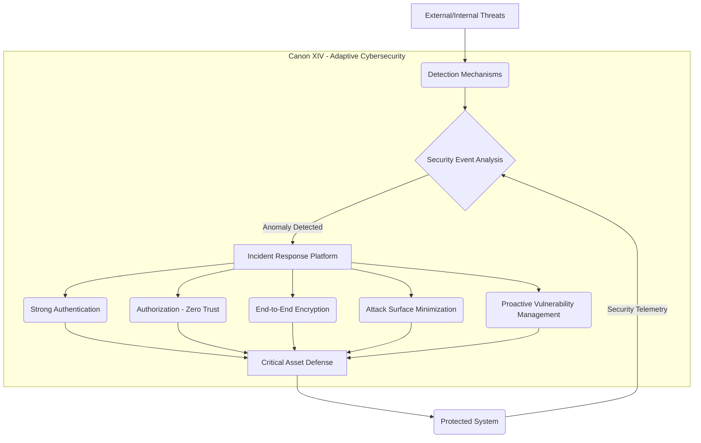

# ⚖️ The Canonical Protocol of Engineering & SI: Software Governance and Verifiable Delegation

**Created by Michel Silva de Souza.**

**Código Canônico de Engenharia & SI** — a software-governance framework for engineers, students and teams working with SI assistants. It brings together architectural rules, decision records and guidance for preserving human understanding of a system.

**Current terminology:** SI — Super Inteligência / Super Intelligence. The [change and adaptation term](./docs/governance/TERMO_DE_MUDANCA_SI_2026-10-10.md) records the owner's direction and operational scope. Original canon texts and historical publications retain their wording, including the archived title *The Canonical Protocol of Engineering & AI*; cite the source version you actually used.

- **[Conheça o projeto em português](https://njfw50.github.io/codigo-canonico-engenharia-ia/)**
- **[Explore the project in English](https://njfw50.github.io/canonical-engineering-ai/)**
- [Original canonical texts](./laws/) · [Decision record template](./template/ADA_template.md) · [How to cite](./CITATION.cff)

## Try a verifiable delegation boundary

**An SI is authorized to prepare a quote. What prevents it from committing a purchase?**

Run the [bilingual delegation example](./examples/delegation/README.md), then inspect the [control-to-article map](./docs/operational/CONTROLS.md) and [reproducible 27-case evidence](./docs/evaluation/delegation-report.json):

```bash
node examples/delegation/demo.js
node test/run.js
node scripts/evaluate.js --check docs/evaluation/delegation-report.json
node cli.js
```

The reference gateway checks exact action scope, recipients/data, amount and aggregate limits, revocation/expiry, fresh state and specific confirmation. It records intent before simulated dispatch and distinguishes blocked, observed and uncertain outcomes. Five declared permitted fixtures execute; 22 declared holds do not dispatch, with no unnecessary holds in this constructed set. This is **synthetic mechanism evidence**, not evaluation of a real SI model, production certification or measured productivity/cognitive benefit.

Node >=14.0.0, no installation, dependencies, paid APIs or external actions. Read the host trust/persistence limits before integration. [Operational governance](./docs/operational/GOVERNANCE.md) · [Pilot procedure](./docs/evaluation/PILOT.md) · [Adoption report template](./template/adoption_report.md)

### New · October 7, 2026 — SI consequence safety and embodied robotics

**Novidade / What's new:** Two new **provisional internal canons**, pending future project ratification, address the transition from SI interpretation to real-world harm: [Canon XXIII — Natural Error Containment](./laws/law23_natural_error_containment.md) and [Canon XXIV — Embodied Agency & Living Integrity](./laws/law24_embodied_agency_living_integrity.md).

[Leia o resumo em português / Read the English overview](./docs/UPDATES_2026-10-07.md) · [Review the provisional text and propose improvements](./CONTRIBUTING.md)

These are governance proposals, not external safety certifications or laws of a government. Cite the current Git commit for these additions; the existing v1.3.1 DOI identifies an earlier archival version.

The project introductions link to the original normative body. Canonical quotations are reproduced verbatim; the authoritative texts remain in this repository.

## Start with one review

**Your SI-generated code works. Can you explain the decision behind it?**

Try the [annotated checkout example — Português / English](./examples/checkout/README.md). Follow a discount decision from its domain rule through an application use case to CLI presentation, then run the checks. Node.js is the only requirement for this example.

```bash
node examples/checkout/demo.js
node examples/checkout/verify.js
```

Run these from a clone of this repository; the example guide includes the clone command and expected output. These checks evaluate the example only. They do not certify another project's architecture.

**Para começar em português:** [experimente o exemplo](./examples/checkout/README.md#português), confira os textos originais e registre uma decisão que você consegue explicar.

[Explore the canons](./laws/) · [Share the project](./docs/SHARE.md) · [Use a source badge](./docs/SHARE.md#add-a-source-badge-to-a-readme) · [Contribute a review](./CONTRIBUTING.md)

[](https://doi.org/10.5281/zenodo.19804968)
[](https://opensource.org/licenses/Apache-2.0)
[](https://nodejs.org/)

## A Structured Technocracy for Software Governance, Combating 'Vibe Coding' and Cognitive Debt in SI-Driven Projects

### 🛡️ The Conceptual Defense (Manifesto)
The modern software development landscape is frequently compromised by stylistic wars, resume-driven development, and the chaotic entanglement of architectural layers. With the advent of autonomous SI agents, the speed of code generation has outpaced the rigor of structural governance, leading to a catastrophic accumulation of technical debt and unmaintainable architectures.

**The Canonical Protocol is our definitive response.**

This repository does not contain mere "best practices" or "suggestions." It establishes a **Structured Technocracy** for **software governance** and **SI engineering**. It operates under the fundamental axiom that **architectural integrity** supersedes personal preference, industry fads, and SI stochasticity. It is the definitive answer to **'Vibe Coding'** and the growing **Cognitive Debt** in development projects involving artificial intelligence.

We reject the notion of technical democracy where every Pull Request is a negotiation of fundamental standards. Instead, we submit to the **Doctrine of the Single Source of Truth (SSOT)**. Every piece of code, whether authored by a human Engineer or an SI collaborator, must undergo a rigorous Canonical Audit. If an implementation violates layer separation or introduces arbitrary complexity, it is inherently defective, regardless of its operational status.

By classifying system components, mandating strict boundaries, and requiring explicit governance for structural changes, the protocol aims to make decisions easier to audit and explain. These are methodological goals; their effect in other projects requires evaluation.

**This is not just code; it is institutional memory.**

---

## Quick start: evaluate one concrete decision

```bash
git clone https://github.com/njfw50/codigo-canonico-engenharia-ai.git
cd codigo-canonico-engenharia-ai
node examples/checkout/demo.js
node examples/checkout/verify.js
```

Expected demonstration: a **$125.00 subtotal**, a **$12.50 discount** and a **$112.50 total**. No package installation is needed. Read the [bilingual walkthrough](./examples/checkout/README.md) and the [worked decision record](./examples/checkout/ADA.md).

## What you can evaluate today

| Component | Available now | Scope |
| --- | --- | --- |
| Normative framework | 25 original canon files, contribution procedure and ADA template | Project rules; status is recorded in each canon. |
| Educational example | Annotated domain rule, application use case, CLI and boundary checks | A fictional checkout policy; not a production payment system. |
| Operational delegation | Trusted policy gateway, confirmation binding, audit records and 27 synthetic fixtures | Bounded three-action simulator; requires protected host boundaries and durable state for real integration. |
| Existing automation | Configuration bootstrap, unit/regression suite, pinned-source and fixture CI checks | Explicitly scoped checks; not a complete architecture verifier or certification. |
| Research context | [Evidence and references](./docs/EVIDENCE.md) | Related studies motivate review practices; they do not validate this protocol. |

### Existing installation hook

The package declares a `postinstall` hook in [package.json](./package.json). When `npm install` is run inside this repository, [inject.js](./inject.js) detects development mode and skips installation. Cloning and running that command therefore does **not** activate governance in another project.

When invoked in a consumer installation context, the script can replace `.cursorrules`, `.github/copilot-instructions.md` and `.windsurfrules`, create `.bak` copies and write `canonical-manifest.json`. Review its target directory and preserve your existing configuration before using it. The checkout example above does not invoke this hook. Configuration instructions remain subject to the host assistant's supported behavior and do not guarantee compliance.

---

## 📊 Architectural Diagram: Adaptive Cybersecurity

Adaptive Cybersecurity, as outlined in **Canon XIV**, is a fundamental pillar of the Canonical Protocol. It emphasizes a proactive, multi-layered approach to system defense, ensuring data integrity and sovereignty. The following diagram illustrates the components and flow of this security architecture.


```mermaid
graph TD
    A[External/Internal Threats] --> B(Detection Mechanisms)
    B --> C{Security Event Analysis}
    C -- Anomaly Detected --> D[Incident Response Platform]
    D --> E(Strong Authentication)
    D --> F(Authorization - Zero Trust)
    D --> G(End-to-End Encryption)
    D --> H(Attack Surface Minimization)
    D --> I(Proactive Vulnerability Management)
    E & F & G & H & I --> J[Critical Asset Defense]
    J --> K(Protected System)
    K -- Security Telemetry --> C
    subgraph Canon XIV - Adaptive Cybersecurity
        B
        C
        D
        E
        F
        G
        H
        I
        J
    end
```

**Diagram Explanation:**

*   **External/Internal Threats:** Represents potential attack vectors.
*   **Detection Mechanisms:** Includes IDS/IPS, SIEM, EDR, etc., which continuously monitor the environment.
*   **Security Event Analysis:** Processes data from detection mechanisms to identify patterns and anomalies.
*   **Incident Response Platform:** Activated upon detecting an anomaly, it coordinates defense actions.
*   **Strong Authentication, Authorization (Zero Trust), End-to-End Encryption, Attack Surface Minimization, Proactive Vulnerability Management:** These are the core principles of Canon XIV, implemented as security controls.
*   **Critical Asset Defense:** Where security principles are applied to protect the system's most valuable resources.
*   **Protected System:** The operational environment that benefits from these defense layers.
*   **Security Telemetry:** Continuous feedback from the protected system to the event analysis, creating an adaptive security improvement cycle.

---

## 📜 The Canonical Body (The 25 Canons): Laws for Software Governance and SI Engineering

The repository contains 25 canon files, organized into functional domains. Canons XXI, XXII, XXIII and XXIV are provisional; Canon XIX includes provisional subclause XIX.3. The original documents define their status.

### Core Foundation & Authority
| Canon | Title |
|-------|-------|
| **Canon 0** | [The Law of Precedence](./laws/law00_precedence.md) |
| **Canon I** | [The Supremacy of Canonical Authority](./laws/law01_authority.md) |
| **Canon II** | [Normative Classification & Structural Segregation](./laws/law02_classification.md) |
| **Canon III** | [Change Procedure & Structural Mutation](./laws/law03_change_procedure.md) |
| **Canon IV** | [Criticality Matrix & Proportionality](./laws/law04_criticality.md) |
| **Canon V** | [The Book of Life (Immutable Audit Log)](./laws/law05_book_of_life.md) |

### Engineering & Architecture
| Canon | Title |
|-------|-------|
| **Canon VI** | [Architectural Discipline & Structural Coherence](./laws/law06_architecture.md) |
| **Canon VII** | [Pattern Library & Architectural Vocabulary](./laws/law07_pattern_library.md) |
| **Canon VIII** | [Pattern Selection Criteria](./laws/law08_pattern_selection.md) |
| **Canon IX** | [Prohibition of Ornamental Patterns](./laws/law09_no_ornamental_patterns.md) |
| **Canon X** | [Layer Segregation & Boundary Enforcement](./laws/law10_layer_separation.md) |
| **Canon XII** | [Pattern Implementation Directives](./laws/law12_pattern_implementation.md) |
| **Canon XVII** | [The Doctrine of Justified Complexity](./laws/law17_justified_complexity.md) |
| **Canon XIX** | [The Doctrine of Reference Integrity](./laws/law19_integrity_of_references.md) |

### Cognitive Sovereignty & SI Subjugation
| Canon | Title |
|-------|-------|
| **Canon XVI** | [The Module of Textual Integrity Protection](./laws/law16_text_integrity.md) |
| **Canon XVIII** | [The Doctrine of Cognitive Sovereignty](./laws/law18_cognitive_sovereignty.md) |

### Emerging Research & Provisional Canons
| Canon | Title |
|-------|-------|
| **Canon XX** | [The Doctrine of Agentic Coordination and Protocol Optimization](./laws/law20_agentic_coordination.md) |
| **Canon XXI** | [The Doctrine of Evaluation-Driven Development (EDD)](./laws/law21_evaluation_driven_development.md) (PROVISIONAL) |
| **Canon XXII** | [The Doctrine of Code Provenance and Traceability](./laws/law22_code_provenance.md) (PROVISIONAL) |
| **Canon XXIII** | [The Doctrine of Natural Error Prevention and Consequence Containment](./laws/law23_natural_error_containment.md) (PROVISIONAL — MP 2026/05) |
| **Canon XXIV** | [The Doctrine of Embodied Agency, Living Integrity and Existential Freedom](./laws/law24_embodied_agency_living_integrity.md) (PROVISIONAL — MP 2026/06) |

### Evolutionary Governance
| Canon | Title |
|-------|-------|
| **Canon XI** | [Amendments & Governance Procedures](./laws/law11_amendments.md) |
| **Canon XIII** | [Normative Expansion Protocol](./laws/law13_normative_expansion.md) |

### Security & Human Interaction
| Canon | Title |
|-------|-------|
| **Canon XIV** | [Digital Security & Cybersecurity Axioms](./laws/law14_cybersecurity.md) |
| **Canon XV** | [User Experience & Interaction Safety](./laws/law15_user_experience.md) |

---

## 🏗️ Repository Structure: A Guide to Software Governance and SI Engineering

| Path | Responsibility |
| --- | --- |
| `laws/` | Original 25 canon texts (0–24). |
| `operational/` | Bounded JSON, delegation gateway, audit chain and pinned source manifest. |
| `examples/` | Checkout and SI delegation demonstrations. |
| `evaluation/` | Declared synthetic scenarios and replay evaluator. |
| `scripts/`, `test/` | Evidence reproduction, scoped audit and regression suite. |
| `docs/book_of_life/`, `docs/congress/` | Decision and historical governance records. |
| `docs/governance/`, `docs/operational/`, `docs/evaluation/` | Change term, coverage, responsibilities and pilot/evidence artifacts. |
| `architecture/`, `template/` | Normative dependency map, ADA and adoption templates. |


## Apply the protocol to a review

1. Choose a small change and identify the business decision it implements.
2. Explain the relevant boundaries with the original canons as references.
3. Run checks that could disprove the expected behavior, including boundary cases.
4. Record the decision, evidence and remaining uncertainty using the [ADA template](./template/ADA_template.md). Compare the [worked example](./examples/checkout/ADA.md).
5. Have the reviewing engineer reconstruct the execution path before adopting the change.

The current `canonical-audit.yml` runs unit/checkout regressions, reproduces the fixture report and checks pinned original source bytes on Node 14 and 24. Its coverage is bounded to this distribution; human comprehension, arbitrary consumer architecture and full canonical compliance require separate review. The [workflow source](./.github/workflows/canonical-audit.yml) defines the exact checks.

## Cite a version and share a result

Silva de Souza, Michel. (2026). *The Canonical Protocol of Engineering & AI: A Structured Technocracy* (v1.3.1). Zenodo. https://doi.org/10.5281/zenodo.21006705

Use [CITATION.cff](./CITATION.cff) for machine-readable metadata. The [project DOI](https://doi.org/10.5281/zenodo.19804968) links the release family; the citation above identifies v1.3.1. If you use changes from `main`, include the commit too.

The [sharing guide](./docs/SHARE.md) has short Portuguese and English introductions and an optional source badge. A useful report includes a real problem, an observed result and a limitation. [Discuss your experience](https://github.com/njfw50/codigo-canonico-engenharia-ai/discussions) or follow [CONTRIBUTING.md](./CONTRIBUTING.md) to propose a change.

---

## License
Licensed under the Apache License, Version 2.0 — see `LICENSE` and `NOTICE` for details.

## Contact & Academic Collaboration
For institutional inquiries, academic collaborations, or questions regarding the implementation of the Canonical Protocol, please reach out via LinkedIn:
-   **[Michel Silva de Souza - LinkedIn](https://www.linkedin.com/in/njfw23/)**

---

## Project governance records

The project's [Session I record](./docs/congress/session_01_lei_xx.md) documents its internal ratification of Canon XX and the status of Canon XIX. Congress terminology describes the project's governance process. Model names and their developers in those records do not establish institutional endorsement, external certification or independent peer review.

Original canons and historical records remain the authoritative source for the project's normative text. The public introduction and [evidence notes](./docs/EVIDENCE.md) distinguish that text from demonstrated software behavior and research findings.
